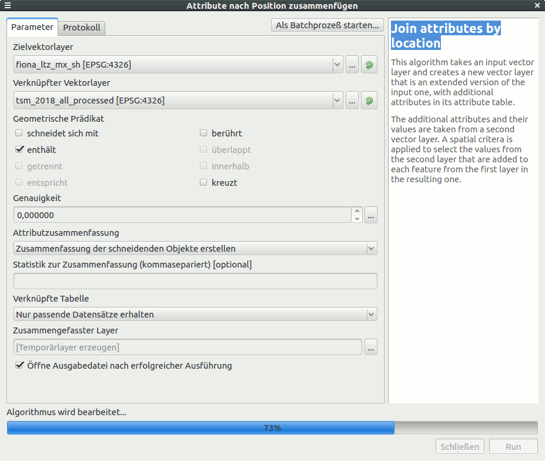

# Aufbereitung von Messdaten

Ausgangsdaten:
* Punktdaten eines Bodenscanners, hier TSM, auf verschiedene shp-Dateien verteilt (eine pro Auftrag/Schlag)
* FIONA-Daten (Invekos bzw. gemeinsamer Antrag in Baden-Württemberg), digitalisierte Schläge als shp

## Identifikation der Flächen, die gescannt wurden

* Zusammenfügen aller shp-Dateien mit Messdaten
    * neues Projekt ohne Layer (vereinfacht die Selektion im Folgenden beim zusammenführen)
    * "load them all"-Extension mit Typ shp und Namensfilter ("Processed")
    * Vektorlayer zusammenführen zu `tsm_2018_all_processed`
* Zusammenfügen aller shp-Dateien mit FIONA-Daten
    * s.o., zu `fiona_ltz_mx_sh`
* Attribute übertragen
    * Attribute zusammenfassen, aber keine Funktionen angeben (mean, etc. löschen)
        * `count` wird als einziger Wert berechnet {width=50%}
* Selektion von Flächen mit zu geringen Messwertanzahlen (GPS Ungenauigkeit, Wendebereiche teilweise in benachbarten Flächen)
    * in der Attributtabelle sortieren, selektieren, prüfen, hier: < 650 Punkte verwerfen
    * Berechnung der Fläche
        * `area()` verwenden und in UTM, damit metrisch rechnen 
            * areautm = `area(transform($geometry, 'EPSG:4326','EPSG:25832'))/10000`
            * nicht `$area` nehmen, das bezieht sich immer auf das CRS des Layers (sinnlos für geographische Koordinaten)
    * Berechnen der Punkte pro Fläche (optional)
        * ptperha = `"count"/"areautm"`
    * speichern als `fiona_scanned_fields_gt_650points`
* Statistiken für Flächensummen über das Statistikfenster (eventuell erst aktivieren, rechtsklick Toolbar + Bedienfelder, icon Symbol: $\sum$)
    * mit "nur gewählte Symbole" Berechnung für Selektion (mit den üblichen Selektionswerkzeugen)

* Export einiger Attribute
    * alle selektieren, c&p in eine .tsv (Tab separated values) Textdatei
    * Selektion (hier mit awk): `awk -F "\t" '{print $10 FS $12 FS $13 FS $(NF-1) FS $NF}' fiona_scanned_fields_gt_650points.tsv > tsm_scanned.tsv`

* Check, ob es Scans außerhalb von FIONA-Flächen gibt
    * "nach Position selektieren" von `tsm_2018_all_processed`, Schnittlayer `fiona_ltz_mx_sh`
    * Selektion invertieren, optional c&p in neuen Layer
