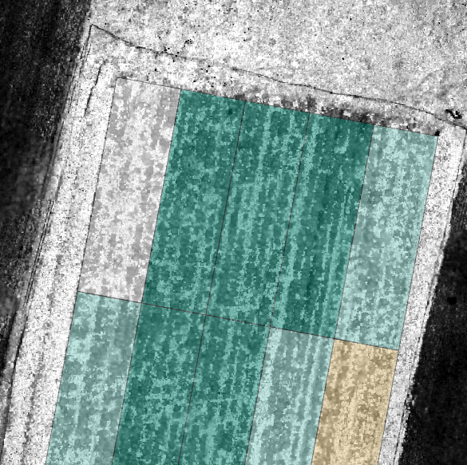
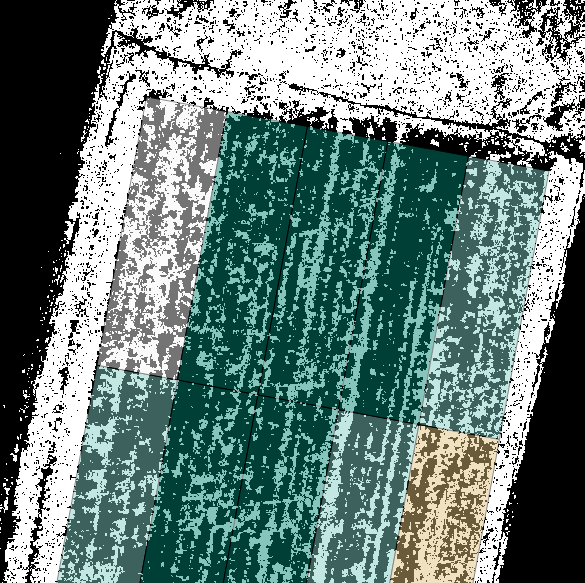

# GGIS EGI analysis

* Input: UAS Orthomosaic, derived with UAS image data, GCP positions and dronedeploy cloud service\

* Load image into QGIS, compute EGI from input with raster calculator
    * Formula: `2*"rgbinput@2"-"rgbinput@1"-"rgbinput@3"` (R: channel 1, G: channel 2  B: channel 3, A: channel 4)\
    

    * colored EGI, different colors for levels\
    

* Threshold EGI image 
    * convert TIF 16 bit to PNG 8 bit `gdal_translate gqgis_egi.tif qgis_egi.png -of png`
    * then use gimp for thresholding \
    
* create plots (line geometry layer)
    * own python script genplot_lines (15x4+0+0m\*9\*5)
        * ensure to use a metric coordinate system for the project, e.g. UTM
	* make editable, select all features (ctrl-a), then move and rotate into the right location
	    * rotate is in extended edit toolbar, you may need to activate via view-toolboxes-advanced digitizing toolbar
        * you may want to directly reproject the geometries to the image CRS (was: WGS84) and save into a file (shp)\
	
* use algorithm *lines to polygon* (vector geometry tools)
    * save as file (shp)\
    
* use extension zonal statics (Zonenstatistikerweiterung) from raster menu
    * activate it in plugin manager, if not yet done already
    * check the image+vector layer CRS, they need to be the same
    * compute zonal statistics for the plots
        * egit\* prefix for thresholded EGI, egi\* for EGI\
	\
	
